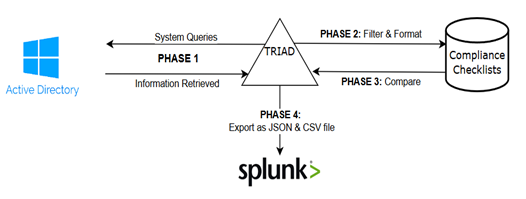
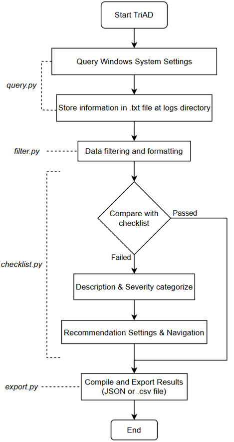

# TriAD
```
 ███████████            ███    █████████   ██████████  
░█░░░███░░░█           ░░░    ███░░░░░███ ░░███░░░░███ 
░   ░███  ░  ████████  ████  ░███    ░███  ░███   ░░███
    ░███    ░░███░░███░░███  ░███████████  ░███    ░███
    ░███     ░███ ░░░  ░███  ░███░░░░░███  ░███    ░███
    ░███     ░███      ░███  ░███    ░███  ░███    ███ 
    █████    █████     █████ █████   █████ ██████████  
   ░░░░░    ░░░░░     ░░░░░ ░░░░░   ░░░░░ ░░░░░░░░░░ 
   
Welcome to TriAD! Starting up...


usage: triad.py [-h] [-nogui] [-n [FILENAME]] [-csv] [-vb]

options:
  -h, --help            show this help message and exit
  -nogui                Run without GUI
  -n [FILENAME], --filename [FILENAME]
                        Specify the name of the csv file
  -csv, --onlycsv       Return only cvs file
  -vb, --verbose        Verbose mode
```  
## Introduction
### I. What is TriAD?

TriAD also known as 3AD is a Python program designed to evaluate security configurations in Active Directory environments, providing detailed reports based on various security policies. 

### II. Workflow

Fig. 1 describes in detail the tool’s workflow, designed to automate the process of auditing Active Directory (AD) security compliance



Fig. 2. TriAD process flow


## Download

Download the latest version of TriAD from the [Release](https://github.com/dotienduc113/3AD/releases) page
## Install 
```git clone``` this repository
```
git clone https://github.com/dotienduc113/3AD
cd Audit
```
Requirement: Using Python3 and install all required dependencies
```commandline
pip install -r requirements.txt
```

## Basic Command
1. To run audit and export to json and csv: 
```triad.py -nogui```
2. To run audit and specify the name of the csv: 
```triad.py -nogui -n [file_name]```
3. To export only csv file: 
```triad.py -nogui -csv```