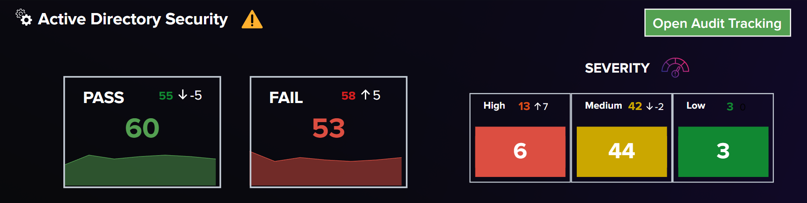

# Domain Controller Monitoring Dashboard

## Overview

The **Domain Controller Monitoring Dashboard** is a Splunk-powered interface designed to provide users with a comprehensive view of their Domain Controller (DC) environments. This dashboard is tailored to help administrators track compliance and security status, validate attack paths, and monitor services across all managed DC systems.

## Key Features

- **Compliance Tracking:** Monitor the adherence to organizational security policies and best practices.
- **Security Posture:** Gain insights into potential vulnerabilities and ensure continuous protection against threats.
- **Attack Path Validation:** Identify and validate potential attack paths to mitigate risks effectively.
- **Service Monitoring:** Ensure critical services across Domain Controllers are running smoothly.

## Prerequisites

Before using the dashboard, ensure the following prerequisites are met:

1. **Splunk Environment:** Splunk Enterprise or Splunk Cloud installed and configured.
2. **Log Forwarding:** Logs from all Domain Controllers are forwarded to Splunk.
3. **Dashboard Dependencies:** Necessary apps and add-ons are installed:
   - Splunk Add-on for Active Directory
   - Any custom scripts or configurations required for attack path validation.

## Setup Instructions

1. **Install the Dashboard:**
   - Download the dashboard JSON/XML file.
   - Import it into your Splunk environment via the "Dashboard Studio" or "Classic Dashboard" editor.

2. **Configure Data Inputs:**
   - Ensure logs from Domain Controllers are properly ingested and indexed in Splunk.
   - Map the required data fields to the dashboard's queries.

3. **Customize Filters:**
   - Adjust filters (e.g., time range, system categories) as per your organizational requirements.

4. **Test the Dashboard:**
   - Validate the accuracy of displayed data by comparing it against known system states.

## Usage

1. **Navigation:**
   - Open the dashboard from the Splunk app menu.
   - Use the sidebar to switch between different views: Compliance, Security, Attack Path, and Services.

2. **Insights and Reports:**
   - Click on any widget or panel for detailed logs and insights.
   - Export data as reports for audit or compliance purposes.

3. **Notifications:**
   - Set up alerts for critical events such as non-compliance, failed services, or detected attack paths.

## Support

For any issues or customization requests, please contact your Splunk administrator or refer to the official Splunk documentation.

## License

This dashboard is licensed under the MIT License. Feel free to modify and adapt it to your needs.

If you have any questions or feedback, feel free to reach out:
- **Author**: HieuVu2402
- **Email**: vuhieu.forwork@gmail.com
- 
---

Stay informed, secure, and compliant with the **Domain Controller Monitoring Dashboard**!
